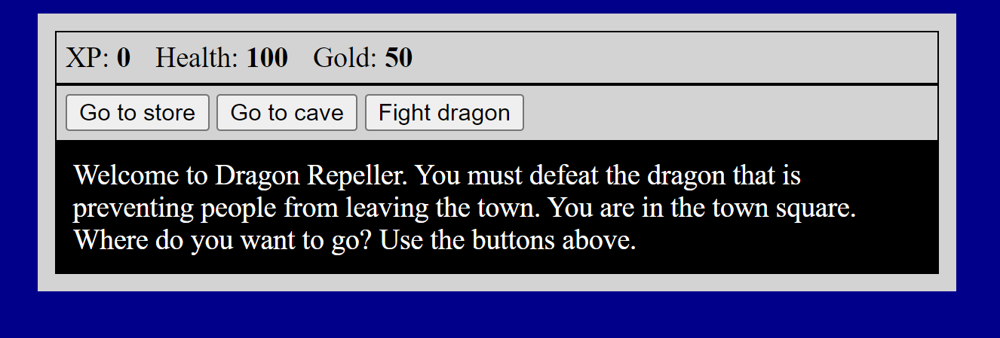

<h1 align="center">RPG Game </h1>

This project is a simple RPG game created using HTML, CSS, and JavaScript.
 
 It is part of a <a href="https://www.youtube.com/watch?v=nu_pCVPKzTk">course</a> on JavaScript provided by freeCodeCamp.

## Getting Started

To run the game, click [here](https://haushinka56.github.io/rpg/)
 

  

## Gameplay

The game is a simple RPG where the player needs to kill a dragon that's been preventing people from leaving the town.
The player can control their character through three buttons at the top.
Beware, as not all buttons are what they seem like!

## Technologies Used

- HTML
- CSS
- JavaScript
- GitHub

## Contributions

This project is part of a course and as such, contributions are not currently being accepted. However, feel free to use the code for your own learning and projects.

## License

This project is licensed under the MIT License - see the [LICENSE.md](LICENSE.md) file for details.

  

## Acknowledgments

A special thanks to [freeCodeCamp](https://www.freecodecamp.org/learn) for providing the course and inspiration for this project.
